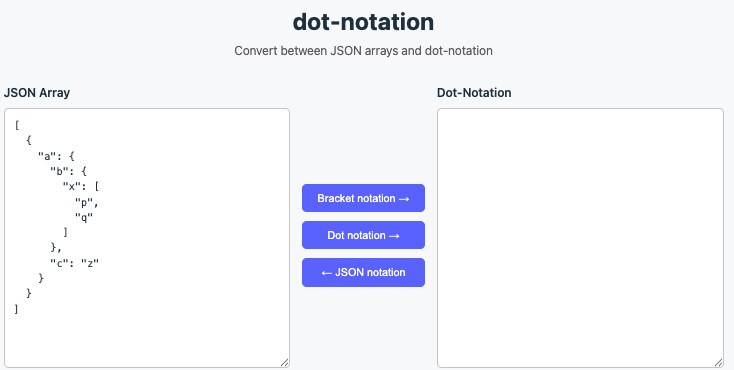

# dot-notation

Convert between JSON arrays and dot-notation.



For example, these two are identical:
```json
[
  {
    "a": {
      "b": {
        "x": [
          "p",
          "q"
        ]
      },
      "c": "z"
    }
  }
]
```
and (using grouped notation):
```
a(b.x(p, q), c.z)
```
or (using dot-only notation):
```
a.b.x.p, a.b.x.q, a.c.z
```

## Syntax

The dot-notation uses the following grammar:

```
field-inclusion-list ::= field-list
field-list           ::= field | field ',' field-list
field                ::= name | name '.' field | name field-set
field-set            ::= '(' field-set-list ')'
field-set-list       ::= field | field ',' field-list
```

When a node has a single child, the dot notation is used: `a.b.c`.
When a node has multiple children, a field-set with parentheses groups them: `a(b, c)`.

### Examples

| Dot-notation | JSON |
|---|---|
| `a.b.c` | `[{"a":{"b":"c"}}]` |
| `a(b, c)` | `[{"a":["b","c"]}]` |
| `a.b(c, d)` | `[{"a":{"b":["c","d"]}}]` |
| `a(b.c, b.d)` | `[{"a":{"b":["c","d"]}}]` |
| `a(b(x(p, q), y), c.z)` | `[{"a":{"b":{"x":["p","q"],"y":null},"c":"z"}}]` |

## Usage

### Development

```bash
npm install
npm run dev
```

### Build

```bash
npm run build
```

### Test

```bash
npm test
```

## License

Copyright (C) 2026, RijnBuve-TomTom

Licensed under the Apache License, Version 2.0 (the "License");
you may not use this file except in compliance with the License.
You may obtain a copy of the License at

   <http://www.apache.org/licenses/LICENSE-2.0>

Unless required by applicable law or agreed to in writing, software
distributed under the License is distributed on an "AS IS" BASIS,
WITHOUT WARRANTIES OR CONDITIONS OF ANY KIND, either express or implied.
See the License for the specific language governing permissions and
limitations under the License.
